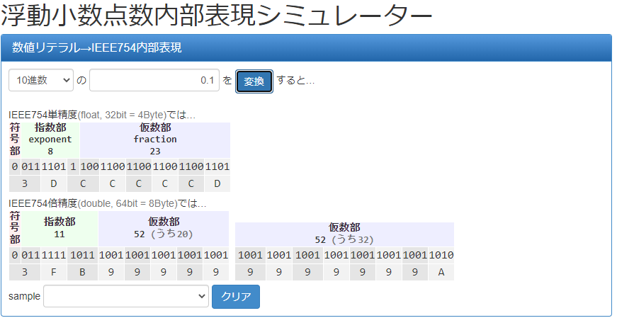

### メモ
#### 【後回し】※順不同
 - [Add stage2 build](https://github.com/rui314/chibicc/commit/5d15431df1abab3a5cf596fabe0a77c030a10791)
 - バッククオート
 - (*var-name)[n]
 - map型
 - 配列の宣言で"[...]int{1,2,3}"みたいなもの
 - 関数戻り値の型チェック(type checking)
 - goroutine
 - "switch" ident.(type) { ... }
 - "switch" Init ";" Condition { ... }
 - complex(複素数)
 - クロージャ
 - gc
 - セルフホストに必要と思われるもの
   - method set(メソッド集合)
   - interface
   - package
   - import
   - slice
     - 初期化
       - array[2:3]みたいなの -> 完了
       - make関数 -> 概ね完了
       - copy関数 -> 概ね完了
       - 二次元以上のsliceの場合、一部appendすると同じdimensionの他のlengthも一緒に変わってしまう  
        => データ構造自体を見直した方が良い?
     - packとunpack
   - rune(int32のエイリアス)
   - rune literal => tokenizerのchar literalを変更する?
   - bool型でtrueやfalseを使用できるように
   - 構造体埋め込みでメソッド集合も埋め込む
   - built-in functions
      - new
      - make -> sliceのみ完了
      - len(slice) -> sliceのみ完了
      - cap(slice) -> sliceのみ完了
      - append(slice) -> 概ね完了（declaration-list内のappend, 「...」等は未実装）
      - copy(slice) -> コンパイラの中で定義するのは無理があるかも、runtime的なものを作ってその中で定義した方が良い
      - println
      - panic
      - recover
   - parseの順番を変える  
     現状では関数の後に宣言されたグルーバル変数を参照するとparserでエラーになるので、var(含初期化), type(含初期化)を先に
   - RangeClause  
     "for i, x := range X"みたいなもの
   - const宣言
   - 文字列の足し算
   - *(*type-name)(unary)
   - 複数の値を返す関数
     - 代入の際のblank identifier 「 _ 」-> 完了
     - 6個（small structは3個）より多くの値を返せるようにする。実現方法：6個を超える返り値に対して同数の~ローカル~グローバル変数を呼び出し側で用意する => 今後呼び出し側のローカル変数に保存するように変更したい（それが必要なことかどうかはわからない）
     - ローカル変数のアドレスをreturnしないように、ローカル変数のアドレスをreturnする場合はグローバル変数に変更する
   - グローバル変数の初期化子に関数を使用できるようにする
       - Addendへの登録でconstExpr()を使うのを止めれば良い?  
          -> RelocationのメンバにAddendExprを作ってそこに構文木を保存  
          -> emitData内でgenExprを呼び出してコード出力  
          でできるかも
    

#### 【VarSpecの追加について】
 - EBNF:VarSpec = ident-list (type-preffix type-specifier [ "=" expr-list ] | "=" expr-list)
 - ~FunctionBody -> BlockStmt -> DeclStmtのSpecメンバ -> x,yのValueSpecがスライスとして登録されている~
 - ~このコンパイラでは、var x,y int = 1,2をparse.goの中でvar x int = 1; var y int = 2;としてfunction()内のstmtの後に繋げる -> declaration()とは別にvarspec()を作り、nodeをつなげたものをfunction()又はstmt()に返す?~
 - declarationで、カンマでつながった変数ごとにNodeを作り、ND_BLOCKで繋げるという方法で完了(2022/03/12)
 - 代入リスト（例：a,b,c = 1,2,3）は、assignList関数でND_ASSIGNを変数ごとに作ってND_BLOCKで繋げてND_EXPR_STMTをrootにしたものを返すことで完了(2022/03/15)

#### 配列変数から配列変数への代入
- ~~現時点では配列変数から配列変数への代入ができない（not a lvalueエラーを出してしまう)~~  
  Type構造体の要素にInitを追加し、Obj構造体の.Ty.InitにInitializerを保存し、代入時に右辺のObjから左辺のObjに.Tyを丸ごとコピーすることで実装済み、~copyType()を使った方が良いかも~  
   => この方法はダメかもしれない。initializerを使用すると代入されたタイミングではなく最初から代入元の文字列が入ってしまうかも
- string変数からstring変数への代入も同様にできない。stringをbase typeがbyteの配列にしているため。⇒string型をarrayType()からpointerTo()にしたら通った。

#### 型が違うので代入できないエラーを返す関数の書きかけ
 - typedefの名前の取得が現時点でできない為
 ```Go
package main

import (
	"errors"
	"strconv"
)

// cannotAssignArr: ty1は代入される方の変数の型、ty2は代入する方の変数の型
func cannotAssignArrErr(ty1, ty2 *Type, tok *Token) error {
	var retTy1, retTy2 string = typeStr(ty1, tok), typeStr(ty2, tok)

	return errors.New(errorTok(tok,
		"cannot use %s {...} (type %s) as Type %s in array literal",
		retTy2,
		retTy2,
		retTy1))
}

func typeStr(ty *Type, tok *Token) string {
	var retTy string
	// make retTy1
	switch ty.Kind {
	case TY_ARRAY:
		retTy += "[" + strconv.Itoa(ty.ArrSz) + "]"
		for ty.Base != nil {
			retTy += typeStr(ty.Base, tok)
		}
	case TY_STRUCT:
		if findTyDef(tok) != nil {
			retTy += tok.Str
		}
	}
	return retTy
}
``` 

#### 2022/01/19
- 引数付の関数定義?呼び出し?時にsegmentation faultが出る
- testdata/commonにc言語で定義するとsegmentation faultにならない
- 2022/01/20 PrologueとEpilogueのレジスタ名が間違っていたのが原因

#### 2022/02/09
 - 下記の場合、nil pointerエラーになる。原因はyのtypeが*intになっているためと思われる。
```Go
var x = [2]int{1, 2}
var y = &x
assert(2, (*y)[1], "(*y)[1]")
```
 - 下記二つのケースではエラーにならない。
```Go
var x = [2]int{1, 2}
var y *[2]int = &x
assert(2, (*y)[1], "(*y)[1]")
```
```Go
var x = [2]int{1, 2}
var y = &x
assert(2, y[1], "y[1]")
```
 - yのtypeが型推論でも *[2]int になるように、initializerを変更する必要がある。
 - 2022/02/10 struct配列へのポインタアドレス代入が可能になるよう変更
 - 上記例で(*y)[0]は動いたが代わりにy[0]がおかしくなった。でも一旦これで。

2022/02/16 Intelマニュアルの複数パラメータ受渡部分の抜粋(DQNEOさんが紹介していた部分)  

From : https://www.intel.com/content/www/us/en/developer/articles/technical/intel-sdm.html#combined  
Copyright © 1997-2021, Intel Corporation. All Rights Reserved.  

 - 6.4.3 Parameter Passing  
Parameters can be passed between procedures in any of three ways: through general-purpose registers, in an argument list, or on the stack.  
 - 6.4.3.1 Passing Parameters Through the General-Purpose Registers  
The processor does not save the state of the general-purpose registers on procedure calls. A calling procedure can thus pass up to six parameters to the called procedure by copying the parameters into any of these registers (except the ESP and EBP registers) prior to executing the CALL instruction. The called procedure can likewise pass parameters back to the calling procedure through general-purpose registers.
 - 6.4.3.2 Passing Parameters on the Stack  
To pass a large number of parameters to the called procedure, the parameters can be placed on the stack, in the stack frame for the calling procedure. Here, it is useful to use the stack-frame base pointer (in the EBP register) to make a frame boundary for easy access to the parameters.  
The stack can also be used to pass parameters back from the called procedure to the calling procedure.
 - 6.4.3.3 Passing Parameters in an Argument List  
An alternate method of passing a larger number of parameters (or a data structure) to the called procedure is to place the parameters in an argument list in one of the data segments in memory. A pointer to the argument list can then be passed to the called procedure through a general-purpose register or the stack. Parameters can also be passed back to the calling procedure in this same manner.  
 - 6.4.3パラメータの受け渡し  
パラメータは、汎用レジスタ、引数リスト、またはスタックの3つの方法のいずれかでプロシージャ間で渡すことができます。
 - 6.4.3.1汎用レジスタを介したパラメータの受け渡し  
プロセッサは、プロシージャ呼び出しで汎用レジスタの状態を保存しません。したがって、呼び出し元のプロシージャは、CALL命令を実行する前に、これらのレジスタ（ESPおよびEBPレジスタを除く）のいずれかにパラメータをコピーすることにより、呼び出されたプロシージャに最大6つのパラメータを渡すことができます。呼び出されたプロシージャも同様に、汎用レジスタを介してパラメータを呼び出し元のプロシージャに戻すことができます。
 - 6.4.3.2スタックでのパラメータの受け渡し  
呼び出されたプロシージャに多数のパラメータを渡すために、パラメータをスタックの呼び出し元のプロシージャのスタックフレームに配置できます。ここでは、（EBPレジスタ内の）スタックフレームベースポインタを使用して、パラメータに簡単にアクセスできるようにフレーム境界を作成すると便利です。
スタックを使用して、呼び出されたプロシージャから呼び出し元のプロシージャにパラメータを戻すこともできます。
 - 6.4.3.3引数リストでのパラメータの受け渡し  
呼び出されたプロシージャに多数のパラメータ（またはデータ構造）を渡す別の方法は、メモリ内のデータセグメントの1つにある引数リストにパラメータを配置することです。次に、引数リストへのポインタを、汎用レジスタまたはスタックを介して呼び出されたプロシージャに渡すことができます。これと同じ方法で、パラメータを呼び出し元のプロシージャに戻すこともできます。

2022/03/30 [System V ABI AMD64 Architecture Processor Supplement (With LP64 and ILP32 Programming Models) Version 1.0 – January 28, 2018 – 8:23](https://github.com/hjl-tools/x86-psABI/wiki/x86-64-psABI-1.0.pdf)から抜粋  
  
**Returning of Values**  
The returning of values is done according to the following algorithm:
1. Classify the return type with the classification algorithm.
2. If the type has class MEMORY, then the caller provides space for the return value and passes the address of this storage in %rdi as if it were the first argument to the function. In effect, this address becomes a “hidden” first argument.
This storage must not overlap any data visible to the callee through other names than this argument.
On return %rax will contain the address that has been passed in by the caller in %rdi.
3. If the class is INTEGER, the next available register of the sequence %rax, %rdx is used.
4. If the class is SSE, the next available vector register of the sequence %xmm0, %xmm1 is used.
5. If the class is SSEUP, the eightbyte is returned in the next available eightbyte chunk of the last used vector register.
6. If the class is X87, the value is returned on the X87 stack in %st0 as 80-bit x87 number.
7. If the class is X87UP, the value is returned together with the previous X87 value in %st0.
8. If the class is COMPLEX_X87, the real part of the value is returned in %st0 and the imaginary part in %st1.  
  
**値の戻り**  
値の戻りは、次のアルゴリズムに従って行われます。
1. 分類アルゴリズムを使用してリターンタイプを分類します。
2. 型のクラスがMEMORYの場合、呼び出し元は戻り値用のスペースを提供し、関数の最初の引数であるかのように、このストレージのアドレスを%rdiで渡します。事実上、このアドレスは「隠された」最初の引数になります。
このストレージは、この引数以外の名前で呼び出し先に表示されるデータと重複してはなりません。
戻り時に、%raxには、%rdiで呼び出し元から渡されたアドレスが含まれます。
3. クラスがINTEGERの場合、シーケンス%rax、%rdxの次に使用可能なレジスタが使用されます。
4. クラスがSSEの場合、シーケンス%xmm0、%xmm1の次に使用可能なベクトルレジスタが使用されます。
5. クラスがSSEUPの場合、8バイトは、最後に使用されたベクトルレジスタの次に使用可能な8バイトチャンクで返されます。
6. クラスがX87の場合、値はX87スタックの%st0に80ビットのx87番号として返されます。
7. クラスがX87UPの場合、値は%st0の前のX87値と一緒に返されます。
8. クラスがCOMPLEX_X87の場合、値の実数部は%st0に返され、虚数部は%st1に返されます。
  
  
#### 2022/02/17 floating-pointを扱う
 - chibiccのcodegen.cのgen_expr関数では、  
 　1. union { float f32; double f64; uint32_t u32; uint64_t u64; } u;を定義  
 　2. tokenのfvalに入っている小数の値をu.f32(floatの場合),又はu.f64(doubleの場合)に格納  
 　3. 同じ大きさのuintのメンバ(u.f32->u.u32,u.f64->u.u64)の値をprintfで%uとして整数で取り出し、raxに入れている  
 - 上記3で取り出した値は、u.f32、u.f64の値をビットで表現した時の、仮数部分を10進数にしたものと同じ？  
   例：0.1（double、10進数）の場合、下記コードで調べるとu.u64は4591870180066957722（10進数）、これを2進数にすると0b10011001100110011001100110011010になる。

```c
#include <stdio.h>
#include <stdint.h>
#include <limits.h>

void printb(unsigned int v) {
  unsigned int mask = (int)1 << (sizeof(v) * CHAR_BIT - 1);
  do putchar(mask & v ? '1' : '0');
  while (mask >>= 1);
}

void putb(unsigned int v) {
  putchar('0'), putchar('b'), printb(v), putchar('\n');
}

int main(void){
    union { float f32; double f64; uint32_t u32; uint64_t u64; } u;
    u.f64=0.1;
    printf("u.f32: %p: %f\n", &u.f32, u.f32);  // u.f32: 0x7fff2119d0d0: -0.000000
    printf("u.f64: %p: %f\n", &u.f64, u.f64);  // u.f64: 0x7fff2119d0d0: 0.100000
    printf("u.u32: %p: %u\n", &u.u32, u.u32);  // u.u32: 0x7fff2119d0d0: 2576980378
    printf("u.u64: %p: %lu\n", &u.u64, u.u64); // u.u64: 0x7fff2119d0d0: 4591870180066957722
    printf("       ");
    putb(u.u64);                               // 0b10011001100110011001100110011010
}
   ```
   また0.1を[このサイト](https://tools.m-bsys.com/calculators/ieee754.php)でIEEE754内部表現にすると下図のようになる。
   

 - このコンパイラで再現するにはどうするか？  
   アセンブリ言語に小数は入れられない？  
   小数の仮数部分を取り出して10進数の数字を得るには?  
   例: 0.1の場合 -> 4591870180066957722を何らかの方法で算出する
   - [Goコードでの内部表現取り出し](https://go.dev/play/p/k3rD8Exk3DX)
```Go
package main

import (
	"fmt"
	"strconv"
)

func main() {
	x := 0.1
	fmt.Printf("%b\n", x)
	fmt.Printf("7205759403792794:             %b\n", 7205759403792794)
	fmt.Printf("4591870180066957722: %b\n", 4591870180066957722)
	fmt.Printf("%d\n", 0b1001100110011001100110011001100110011001100110011010)
	f := strconv.FormatFloat(7205759403792794, 'f', -1, 64)
	fmt.Println(f)
}
```
output:
```
7205759403792794p-56
7205759403792794:             11001100110011001100110011001100110011001100110011010
4591870180066957722: 11111110111001100110011001100110011001100110011001100110011010
2702159776422298
7205759403792794

Program exited.
```
 - 下記でいいみたいです。参照:https://pkg.go.dev/unsafe#Pointer , https://qiita.com/nia_tn1012/items/d26f0fc993895a09b30b#23-%E3%83%9D%E3%82%A4%E3%83%B3%E3%82%BF%E3%81%AE%E3%82%AD%E3%83%A3%E3%82%B9%E3%83%88%E5%A4%89%E6%8F%9B%E3%82%92%E5%88%A9%E7%94%A8%E3%81%97%E3%81%9F%E6%96%B9%E6%B3%95-c%E8%A8%80%E8%AA%9Ecc-
```Go
package main

import (
	"fmt"
	"unsafe"
)

func main() {
	x := 0.1
	s := *(*uint64)(unsafe.Pointer(&x)) // ここ
	fmt.Println(s)
}
```

#### 2022/02/18 左辺ポインタのキャスト変換&書き込みの例[URL](https://go.dev/play/p/FlES6L9lUOU)
```Go
package main

import (
	"fmt"
	"unsafe"
)

func main() {
	var x [2]int64

	var idx int = 1
	*(*float32)(unsafe.Pointer(uintptr(unsafe.Pointer(&x[0])) + idx*unsafe.Sizeof(x[0]))) = 11
	*(*float32)(unsafe.Pointer(&x[idx])) = 11 // ↑の短縮版
	// *(*float32)(&x[idx]) = 11 => c言語風の書き方はできない
	fmt.Printf("%d\n", x)
	s = *(*int32)(unsafe.Pointer(&x))
	fmt.Println(s)
}
```

#### 2022/03/07 関数名を引数に取る関数の定義の例[URL](https://go.dev/play/p/xctRHJDCJJn)
```Go
package main

import (
	"fmt"
	"unsafe"
)

func ret3(b int) int {
	return 3 + b
}

func add2(a int, b int) int8 {
	return int8(a + b)
}

func param_decay(f func(int) int, a int) int {
	return f(a)
}

func main() {
	fmt.Println(param_decay(ret3, 100))
	var a func(int, int) int8 = add2
	fmt.Println(a(1, 2))
	fmt.Printf("a: %T\n", a)

	fmt.Println(unsafe.Sizeof(a))
	fmt.Println(unsafe.Sizeof(a(1, 2)))
}
```
```C
#include <stdio.h>

int add2(int a, int b) {
    return a + b;
}

int ret3() {
    return 3;
}

int main(void){
    int (*fn)(int,int)=add2;
    printf("%d\n", fn(1,2));
    printf("%u\n",fn);
    
    int (*fn2)()=ret3;
    printf("%d\n", fn2());
    printf("%u\n",fn2);
}
```
https://cloudsmith.co.jp/blog/backend/go/2021/06/1816290.html

#### 2022/04/04 testdata/commonに#defineマクロを入れても意味がない
 - 定義したCファイル内のトークンを置き換えるものだから。もし入れるのであれば、ヘッダーファイルに入れる必要がある。

#### 2022/04/19 appendで元の容量が足りない場合の旧基底配列から新基底配列への値のコピーができない
 - makeでsliceを作成した後に、代入した値はコピーされない.
 - initializer, sliceExprでsliceを作成し、後から値を代入した場合はコピーされるみたい => makeの処理に問題がありそう
 - コピーする時には a[0]=b[0] の様になるから、下記でいいはずなんだけど
 ```Go
      lhs := newUnary(ND_DEREF,
        newAdd(uaNode, newNum(i, tok), tok), tok)
      addType(lhs)
      // 右辺がnewUnary(ND_DEREF, newAdd(slice, newNum(i, tok), tok), tok)だと上手く代入できない
      // sliceがダメらしい
      rhs := newUnary(ND_DEREF,
        newAdd(v.Ty.UArrNode, newNum(v.Ty.UArrIdx+i, tok), tok), tok)
      addType(rhs)
      fmt.Printf("primary: rhs.Ty: %#v\n\n", rhs.Ty)
      expr := newBinary(ND_ASSIGN, lhs, rhs, tok)
  ```
 - newAdd内でSizeごとのAlignが必要? => postfix関数で既にやっているし、問題ないように見える
 - ヒントになりそうなCコード
 ```c
  #include <stdio.h>

  char *a[] = {"acb","def","ghi","jkl"};
  char *b[] = {"mno","pqr","stu","vwx"};

  int main(void){
      // Your code here!
      int *x=&*(b+1);
      *x="yz";
      *(a+1) = *(x+1);
      printf("sizeof: %d\n", sizeof(b[1]));
      printf("%s\n", *(x-2));
  }
 ```
 - ヒントになりそうな[Cコードその2](https://paiza.io/projects/7xIFRBhAo7kYPKeWrTaBSg)
 ```c
  #include <stdio.h>

  int a[]={1,2,3,4,5};
  char *b[]={"abcc","def","ghi"};

  int main(void){
      // Your code here!
      a[1]=100;
      int *x=&*(a+1);
      *(x+1)=1000;
      printf("%d\n", *(a+1)); // 100
      printf("%d\n", x[3]); // 5
      printf("%d\n", *(x+1)); // 1000
      printf("%d\n", a[2]); // 1000
      
      printf("int: %d\n", sizeof(int));
      int *y=&*(b+0);
      printf("%s\n", *(y+2)); // +0の場合:abc, +2の場合:def, +4の場合:ghi
  }
 ```
 - 2022/04/24 原因判明:
   - initializer2の処理が間違っており基底配列を二つ作っていた
   - 型推論（左辺がTY_VOID）の時に、make関数で作られる基底配列（一回目）をNode.Ty.UArrNodeに入れているが、sliceを示す変数には二回目に作られた基底配列へのポインタアドレスを代入していた為

 - 2022/05/27 多値返却関数について参考になりそうなcompiler explorerのリンク  
 https://godbolt.org/z/aT4dWqsM1  
 https://godbolt.org/z/eGPxnn78x
 https://godbolt.org/z/nPMPeYsb3

2023/02/20 GoのABIで返り値に使用するレジスタをChatGPTに聞いてみた結果
> Go言語では、x86-64アーキテクチャにおいて、デフォルトのABI（Application Binary Interface）として、System V ABIが使用されます。このABIでは、レジスタとスタックの両方が使用されます。

> 返り値が単一のワード（8バイト以下）である場合、RAXレジスタに値が格納されます。返り値が8バイトを超える場合は、RAXとRDXレジスタに分割して格納されます。

> 一方、返り値のサイズが大きくても、ポインタを介して値を返すことができます。この場合、呼び出し側はメモリを割り当てて、呼び出された関数にポインタを渡します。関数は、値を割り当てられたメモリに書き込み、ポインタを返します。この方式では、呼び出し側がメモリを解放する必要があります。

> また、返り値がポインタである場合、レジスタに格納するのではなく、RAXに返すポインタを格納します。

> なお、Go言語には関数の呼び出し規約をカスタマイズできる機能があり、これによりABIを変更することができます。しかし、デフォルトのABIは、x86-64アーキテクチャにおいて最も一般的に使用されているものの1つであり、多くのライブラリやツールチェーンでサポートされています。

> 返り値が６つまでの場合に使用されるレジスタは何ですか

> Go言語において、関数の返り値が最大6つの場合、デフォルトのSystem V ABIでは以下のレジスタが使用されます。

 | 返り値の個数 |	レジスタ |  
 | ----------- | ------- |
 | 1  | RAX |  
 | 2	| RAX, RDX |  
 | 3	| RAX, RDX, RCX |  
 | 4	| RAX, RDX, RCX, RBX |  
 | 5	| RAX, RDX, RCX, RBX, RSI |  
 | 6	| RAX, RDX, RCX, RBX, RSI, RDI |  
> 例えば、以下のような関数があるとします。

```go
func foo() (int, int, int) {
    return 1, 2, 3
}
```
> この関数は、3つの整数を返します。これらの整数は、最大6つの値であるため、デフォルトのSystem V ABIでは、最初の3つの整数がRAX、RDX、RCXレジスタに格納されます。

> したがって、この関数のコンパイルされたアセンブリコードでは、まずRAXレジスタに最初の整数である1が格納され、続いてRDXレジスタに2、RCXレジスタに3が格納されます。その後、関数が正常に終了すると、RAXレジスタには最初の整数である1が残り、他の2つの整数は関数の呼び出し元に返されます。

> 注意点として、返り値がレジスタに格納される場合、関数の呼び出し元は、そのレジスタの内容をコピーして使用するため、返り値が不変であることが期待されます。したがって、関数内で変更した場合、関数の呼び出し元に予期しない結果が返される可能性があるため、避けるべきです。